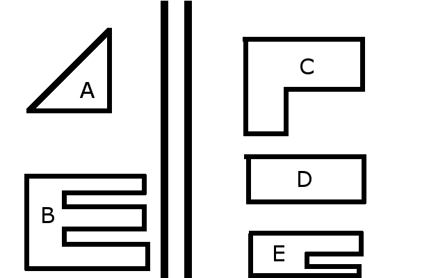
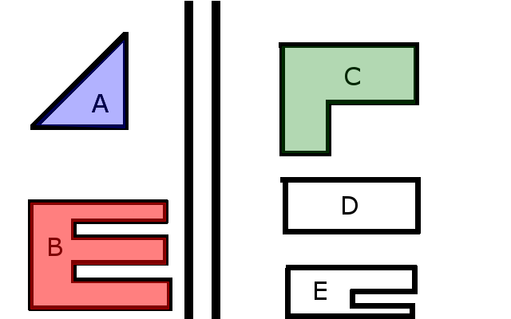

# pyhighlight

A tiny Python 3 wrapper to make highlighting portions of an image much easier

## Installation

Installing is best done using `pip`:

```shell
python3 -m pip install pyhighlight
```

Another option is to clone the repo and copy the `pyhighlight` module folder (containing `__init__.py`) into your project directory.

## Usage

The wrapper utilizes three functions:

| Name | Description |
| -----|------------ |
| `pyhighlight(image_path)` | The constructor, takes in the base image's file path |
| `highlight(points, color, transparency)` | Highlights a portion of the image. <ul><li>`points` - An array of arrays containing the corresponding points (ie. `[[1, 1], [2, 2]]`). Note: the points *must* be in order or the highlighted image will look weird. **Required**.</li><li>`color` - A string for the desired color of the highlighted portion. Defaults to `'blue'`. *Optional*.</li><li>`transparency` - A float between 0 and 1 for how transparent the highlighting should be. *Optional*.</li></ul> |
| `save(output_path)` | Saves the generated image to the file path specified

## Example

Let's say you have an image of some buildings you want to highlight:



Assuming you know the points on the image that you want to highlight, a tiny script can be written to easily generate a new image with those buildings highlighted:

```python
import pyhighlight as ph

# Assuming we want to highlight buildings A, B, and C
# from the example image
points = {
    'A': [[45, 156], [155, 50], [156, 160]],
    'B': [[37, 253], [206, 253], [206, 276], [90, 276], [90, 297], [206, 297],
         [206, 330], [90, 330], [90, 352], [210, 352], [210, 386], [37, 386]],
    'C': [[352, 57], [518, 57], [518, 128], [410, 128], [410, 190], [352, 190]]
}

test = ph.pyhighlight('example_buildings.png')
test.highlight(points['A'])
test.highlight(points['B'], color='red', transparency=0.5)
test.highlight(points['C'], color='green')

test.save('example.png')
```

The final result:



## License

MIT License

Copyright (c) 2018 Tyler Burdsall

Permission is hereby granted, free of charge, to any person obtaining a copy
of this software and associated documentation files (the "Software"), to deal
in the Software without restriction, including without limitation the rights
to use, copy, modify, merge, publish, distribute, sublicense, and/or sell
copies of the Software, and to permit persons to whom the Software is
furnished to do so, subject to the following conditions:

The above copyright notice and this permission notice shall be included in all
copies or substantial portions of the Software.

THE SOFTWARE IS PROVIDED "AS IS", WITHOUT WARRANTY OF ANY KIND, EXPRESS OR
IMPLIED, INCLUDING BUT NOT LIMITED TO THE WARRANTIES OF MERCHANTABILITY,
FITNESS FOR A PARTICULAR PURPOSE AND NONINFRINGEMENT. IN NO EVENT SHALL THE
AUTHORS OR COPYRIGHT HOLDERS BE LIABLE FOR ANY CLAIM, DAMAGES OR OTHER
LIABILITY, WHETHER IN AN ACTION OF CONTRACT, TORT OR OTHERWISE, ARISING FROM,
OUT OF OR IN CONNECTION WITH THE SOFTWARE OR THE USE OR OTHER DEALINGS IN THE
SOFTWARE.
